# PLANTS RESCUE

Game Design Document

Gry Komputerowe — Projekt, środa 9:15

## Spis treści

- [1. Informacje ogólne](#1-informacje-ogólne)
  - [1.1. Tytuł](#11-tytuł)
  - [1.2. Gatunek](#12-gatunek)
  - [1.3. Odbiorcy](#13-odbiorcy)
  - [1.4. Platforma i wymagania sprzętowe](#14-platforma-i-wymagania-sprzętowe)
  - [1.5. Monetyzacja (model biznesowy)](#15-monetyzacja)
- [2. Tematyka i osadzenie gry](#2-tematyka-i-osadzenie-gry)
  - [2.1. Lokacje — poziomy (pokoje)](#21-lokacje--poziomy-pokoje)
  - [2.2. Fabuła](#22-fabuła)
    - [2.2.1. Wprowadzenie](#221-wprowadzenie)
    - [2.2.2. Główne wątki fabularne](#222-główne-wątki-fabularne)
    - [2.2.3. Zakończenia](#223-zakończenia)
  - [2.3. Postaci](#23-postaci)
    - [2.3.1. Bohater — Student](#231-bohater--student)
    - [2.3.2. Rośliny przyjazne (do podlania)](#232-rośliny-przyjazne-do-podlania)
    - [2.3.3. Zmutowane potwory (przeciwnicy)](#233-zmutowane-potwory-przeciwnicy)
    - [2.3.4. Inteligencja NPC (AI przeciwników)](#234-inteligencja-npc-ai-przeciwników)
- [3. Rozgrywka i mechaniki](#3-rozgrywka-i-mechaniki)
  - [3.1. Cele i wyzwania](#31-cele-i-wyzwania)
    - [Cel główny każdego poziomu](#cel-główny-każdego-poziomu)
    - [Mechanika paska nawodnienia](#mechanika-paska-nawodnienia)
    - [System uzbrojenia](#system-uzbrojenia)
  - [3.2. Interakcja i kontrolery](#32-interakcja-i-kontrolery)
  - [3.3. Onboarding, podpowiedzi i naprowadzanie (UX)](#33-onboarding-podpowiedzi-i-naprowadzanie-ux)
  - [3.4. Postęp, ustawienia i sekretny poziom](#34-postęp-ustawienia-i-sekretny-poziom)
- [4. Przebieg gry](#4-przebieg-gry)
  - [4.1. Ekran tytułowy](#41-ekran-tytułowy)
  - [4.2. Intro — list i karty tytułowe](#42-intro--list-i-karty-tytułowe)
  - [4.3. Menu, HUD i ekrany pośrednie](#43-menu-hud-i-ekrany-pośrednie)
    - [Menu startowe](#menu-startowe)
    - [Menu pauzy i ustawienia](#menu-pauzy-i-ustawienia)
    - [HUD (Head-Up Display)](#hud-head-up-display)
    - [Ekran Game Over](#ekran-game-over)
    - [Ekran ukończenia poziomu i zakończenia gry](#ekran-ukończenia-poziomu-i-zakończenia-gry)
    - [System tutoriali (toasty) i zwoje fabularne](#system-tutoriali-toasty-i-zwoje-fabularne)
- [5. Zakres projektu](#5-zakres-projektu)
  - [5.1. Zespół 2-osobowy — podział prac](#51-zespół-2-osobowy--podział-prac)
  - [5.2. Harmonogram prac](#52-harmonogram-prac)
  - [5.3. Utrzymanie i post-produkcja](#53-utrzymanie-i-post-produkcja)
  - [5.4. Pochodzenie assetów i kodu (wkład własny vs AI)](#54-pochodzenie-assetów-i-kodu-wkład-własny-vs-ai)
- [6. Assety](#6-assety)
  - [6.1. Grafika — sprity, tekstury, animacje](#61-grafika--sprity-tekstury-animacje)
    - [Stany gracza](#stany-gracza)
    - [Stany roślin](#stany-roślin)
    - [Wrogowie i bossy](#wrogowie-i-bossy)
    - [Pickupy świata](#pickupy-świata)
    - [Tła i obiekty](#tła-i-obiekty)
    - [Ekrany zakończeń](#ekrany-zakończeń)
    - [UI](#ui)
    - [Narzędzia graficzne](#narzędzia-graficzne)
  - [6.2. Audio](#62-audio)
- [7. Prototyp (Proof of Concept)](#7-prototyp-proof-of-concept)
  - [7.1. Cel prototypu](#71-cel-prototypu)
  - [7.2. Technologie i zasoby startowe](#72-technologie-i-zasoby-startowe)
  - [7.3. Kryteria sukcesu prototypu](#73-kryteria-sukcesu-prototypu)

## 1. Informacje ogólne

### 1.1. Tytuł

Plants Rescue

Podtytuł: Water or Fight

### 1.2. Gatunek

| Kategoria | Opis |
| --- | --- |
| **Gatunek główny** | 2D Top-down Action |
| **Podgatunki** | Casual, Story-driven |
| **Styl graficzny** | Pixel Art 2D, widok z góry |

### 1.3. Odbiorcy

- Młodzi dorośli (18–30 lat)
- Gracze casualowi szukający krótkiej, zabawnej rozrywki
- Fani pixel artu i retro estetyki

### 1.4. Platforma i wymagania sprzętowe

| Parametr | Wartość |
| --- | --- |
| **Platforma docelowa** | PC (Windows) |
| **Silnik** | Godot 4.6.2 |
| **Renderer** | GL Compatibility (Windows: sterownik D3D12) |
| **Min. RAM** | 4 GB |
| **Min. GPU** | Karta ze wsparciem OpenGL 3.3 / Direct3D 12 |
| **Rozdzielczość** | Skalowalna (`stretch/mode = canvas_items`); okno startuje zmaksymalizowane, F11 przełącza pełny ekran |
| **Ustawienia obrazu/dźwięku** | Suwaki głośności muzyki i efektów oraz jasności ekranu (zapisywane do `user://settings.cfg`) |
| **Dysk** | ~200 MB na projekt i assety |
| **OS** | Windows 10+ |
| **Połączenie** | Niewymagane do rozgrywki (build lokalny) |

### 1.5. Monetyzacja

Gra ma charakter edukacyjno-zaliczeniowy — brak modelu komercyjnego.

- Dystrybucja: bezpłatna, udostępniana jako projekt uczelniany
- Brak mikrotransakcji, reklam ani DLC

## 2. Tematyka i osadzenie gry

### 2.1. Lokacje — poziomy (pokoje)

Gra osadzona jest w studenckiej kawalerce / mieszkaniu dzielonym. Każdy pokój to osobny poziom z unikalnym zestawem roślin i wyzwań. Na początku każdego poziomu bojowego wyświetla się **zwój pergaminowy z opisem fabularnym** (pauzuje grę do potwierdzenia), a następnie krótka **karta tytułowa** „POZIOM N — Nazwa".

| Poziom | Opis | Status |
| --- | --- | --- |
| **Pokój 0 — Przedpokój (Foyer)** | Tutorial. Gracz czyta list wprowadzający fabułę, po czym pojawia się karta „POZIOM 0 — Wprowadzenie" oraz kolejka komunikatów samouczka (ruch, atak, strzał, przełączanie substancji, auto-celowanie, interakcja). Dostępny jest przycisk **„Pomiń samouczek"**. Brak wrogów i roślin do podlania. Po prawej stronie znajdują się drzwi do salonu — gracz podchodzi i wciska SPACJA/E (podpowiedź kontekstowa). | ✅ Zaimplementowany |
| **Pokój 1 — Salon (Living Room)** | Główny poziom rozgrywki. 3 rośliny do podlania + 4 wrogie rośliny (EnemyPlant). Gracz uczy się strzelania wodą (PPM), przełączania na kwas (X), ataku nożyczkami (LPM) oraz target-locka (środkowy przycisk myszy). W pokoju znajdują się: lodówka (zgrzewka piwa), apteczka, zgrzewka z butelkami wody — każda z podpowiedzią kontekstową. Po wykonaniu wszystkich celów drzwi wyjściowe się odblokowują. Czas przejścia jest mierzony. | ✅ Zaimplementowany |
| **Pokój 2 — Kuchnia (Kitchen)** | 4 rośliny + 4 wrogie rośliny + boss **Pnącze gniewu** (BossVine, HP 200). Pokonanie bossa daje permanentny bonus do zasięgu nożyczek (×1.35). Na poziomie znajduje się lodówka kuchenna (piwo), apteczka i zgrzewka z butelkami wody. | ✅ Zaimplementowany |
| **Pokój 3 — Sypialnia (Bedroom)** | 3 rośliny + 4 wrogie rośliny + **Grzybek halucynek — boss** (BossMushroom, HP 250) spowalniający aurą gazu. Apteczka i zgrzewka z butelkami wody. Wąskie przejścia między łóżkiem, szafą i biurkiem. Pokonanie wszystkich wrogów odblokowuje przejście dalej. | ✅ Zaimplementowany |
| **Pokój 4 — Pokój gamingowy (Gaming Room)** | Finałowy poziom. 3 rośliny + 4 wrogie rośliny + boss **Palma kokosowa** (BossPalm, HP 300, 2 fazy, ataki melee/medium/dalekosiężne kokosami). Ukończenie poziomu kończy całą grę i wyświetla jedno z trzech zakończeń zależne od stylu gry. | ✅ Zaimplementowany |
| **Sekretny poziom — Wąż (Snake)** | Mini-gra w stylu klasycznego „Węża" w pikselowej oprawie. Odblokowuje się w „Wyborze poziomu" po ukończeniu wszystkich 4 poziomów bojowych. Sterowanie strzałkami/WASD, zjadanie roślin zwiększa wynik, kolizja kończy grę. | ✅ Zaimplementowany |

### 2.2. Fabuła

#### 2.2.1. Wprowadzenie

Zapracowany student informatyki na pierwszym roku studiów magisterskich wraca po dwutygodniowej sesji egzaminacyjnej do swojego mieszkania. W tym czasie całkowicie zapomniał o swoich licznych roślinach doniczkowych. To, co go wita, to armia zeschniętych, rozgniewanych zielonych stworzeń, które mają dość bycia ignorowanymi.

Na parapecie leży konewka, a w szufladzie nożyczki do przycinania. Student musi przejść przez całe mieszkanie, pogodzić się z roślinami lub je pokonać, zanim jego koledzy wrócą z wyspy.

Fabuła jest przekazana graczowi poprzez **list** znaleziony na podłodze po wejściu do przedpokoju, a następnie poprzez **zwoje pergaminowe** z krótką narracją na początku każdego pokoju (humorystyczny, studencki ton).

#### 2.2.2. Główne wątki fabularne

Przejście przez pokoje mieszkania, podlanie przyjaznych roślin i pokonanie zmutowanych potworów. Każdy pokój wymaga spełnienia określonych celów (podlanie roślin + zabicie wrogów), aby otworzyć drzwi do następnego. Styl gracza (ilu przyjaznych roślin zepsuł/zabił) decyduje o jednym z trzech zakończeń.

#### 2.2.3. Zakończenia

Po ukończeniu ostatniego poziomu kampanii wyświetla się ekran zakończenia. Wariant zależy od liczby przyjaznych roślin zniszczonych w trakcie całej rozgrywki (`GameState.campaign_plants_killed`):

| Wariant | Warunek | Tytuł | Nastrój / grafika |
| --- | --- | --- | --- |
| **Pacyfistyczne** | 0 zniszczonych roślin | „OGRÓD OCALONY" | Słoneczne, ocalałe mieszkanie z kwitnącymi roślinami; ciepły, pozytywny ton |
| **Neutralne** | 1–5 zniszczonych | „KRUCHY POKÓJ" | Przygaszone wnętrze: kilka zdrowych roślin + kosz z uschniętymi; bittersweet |
| **Wrogie** | ≥ 6 zniszczonych | „ROŚLINNA APOKALIPSA" | Płonące mieszkanie i płonące rośliny; mroczny, dramatyczny ton |

Ekran zakończenia pokazuje narrację (pierwszoosobowy monolog studenta), statystyki (uratowane / zniszczone rośliny) oraz przycisk powrotu do menu. Panel tekstu automatycznie dopasowuje wysokość do długości opisu.

### 2.3. Postaci

#### 2.3.1. Bohater — Student

| Cecha | Opis |
| --- | --- |
| **Imię** | „Student" |
| **Wygląd** | Pixel art, student w bluzie z kapturem, jeansach i klapkach z białymi skarpetkami |
| **HP startowe** | 90 (3 pikselowe serduszka po 30 HP każde); po pokonaniu Grzybka halucynek max HP rośnie do 120 (4 serca, +1 serce permanentnie) |
| **Prędkość** | 300 px/s (×1.5 przy aktywnym buffie piwa przez 10 s) |
| **Atak wręcz (nożyczki)** | 20 obrażeń, z animacją i hitboxem kierunkowym; gracz może atakować **jednocześnie z chodzeniem**; po pokonaniu Pnącza gniewu zasięg rośnie ×1.35 (permanentnie, persystuje między poziomami) |
| **Zbiornik wody** | Pojemność: 100, koszt strzału: 10, regeneracja: napełnianie zgrzewką z butelkami wody (+25 / butelkę, max 6 butelek na zgrzewkę) z cooldownem 1 s. Próba strzału przy pustym zbiorniku wyświetla podpowiedź „Brak wody!" |
| **Zbiornik kwasu** | Pojemność: 100, koszt strzału: 10, cooldown po opróżnieniu: 7 s (auto-refill do 100) |
| **Reakcja na trafienie** | Czerwony błysk (flash) + knockback (odepchnięcie od źródła obrażeń) z krótkim i-frame wizualnym |
| **Piwo (perk)** | Zbierane z lodówek (zgrzewka 6 sztuk) i podnoszone z ziemi. Aktywowane klawiszem Q — przez 10 s prędkość ruchu ×1.5. Liczba piw persystuje między poziomami. |
| **Apteczka** | Heal +30 HP po interakcji (E / SPACJA), znika po użyciu |
| **Animacje** | idle, run, attack (kierunkowe: right/up/down, flip_h dla left), dying |

#### 2.3.2. Rośliny przyjazne (do podlania)

Rośliny przyjazne (`FriendlyPlant`) — stoją nieruchomo, pasek nawodnienia widoczny nad nimi (0–100%). Rozpoczynają z wygaszonym kolorem (blade/suche) i **delikatnie „oddychają" (pulsacja skali)**, co naprowadza wzrok gracza na rośliny wciąż wymagające pomocy. Dodatkowo nad nieuratowaną rośliną pojawia się podpowiedź „PPM — podlej wodą", gdy gracz jest blisko. W miarę podlewania rośliny jaśnieją (każde trafienie wodą +20). Po osiągnięciu 100% roślina „rozkwita" — animacja flashu + zmiana sprite'a na kwitnącą wersję z delikatną pulsacją (puls naprowadzający zostaje wyłączony).

**Zachowanie pod atakiem (mechanika zepsucia w przeciwnika):**

- Nieuratowana roślina (water < 100): trafienie kwasem lub nożyczkami natychmiast przekształca ją we wrogą roślinę (`EnemyPlant`); aby nie blokować zaliczenia celu, cel „roślin do podlania" jest zmniejszany, a licznik wrogów rośnie o 1. Wyświetla się komunikat diagnostyczny „Zaatakowana roślina zbuntowała się…".
- Uratowana roślina (rozkwitnięta, water = 100): wymaga 3 trafień nożyczkami/kwasem, aby się zepsuć. Po każdym trafieniu wyświetla dialog („Nie zrobiłam ci krzywdy…", „To mnie boli, zaraz się zezłoszczę…", „Ostrzegałam!!!"), a po trzecim trafieniu (z opóźnieniem 0,6 s) przekształca się we wrogą roślinę.

#### 2.3.3. Zmutowane potwory (przeciwnicy)

W grze zaimplementowane są następujące typy przeciwników:

- **Wroga roślina (`EnemyPlant`)** — podstawowa zmutowana roślina-potwór (scena `enemy_plant.tscn`, skrypt `enemy_plant.gd`). HP: 100, prędkość: 100 px/s, obrażenia: 15 przy kontakcie (co 0,8 s). Stany: idle, pościg (chase), atak kontaktowy (spine_attack), śmierć. Reaguje na obrażenia: czerwony flash + knockback. Nad głową pasek HP. Występuje na wszystkich poziomach bojowych.
- **Grzybek halucynek (Mushroom)** — dystansowy przeciwnik strzelający zarodnikami (spore_projectile). HP: 80, prędkość: 80 px/s, obrażenia od zarodnika: 12, interwał ataku: 1,5 s, prędkość pocisku: 200 px/s. Stany: idle, walk_east/walk_south, attack, die.
- **Pnącze gniewu (BossVine)** — szybki boss melee. HP: **200**, prędkość: 210 px/s, obrażenia ataku slam: **27 (+50%)**, zasięg wyzwalania ataku zmniejszony o 25%, windup 0,12 s + active 0,18 s + cooldown 0,95 s, knockback 380. Atak telegrafowany animacją uderzenia kolcami. Boss Kuchni. Po pokonaniu permanentny bonus: zasięg nożyczek ×1.35.
- **Grzybek halucynek — boss (BossMushroom)** — boss spowalniający gazem. HP: **250**, prędkość: 70 px/s. Aura gazu spowalnia gracza do ×0,55 prędkości i zadaje 6 obrażeń co 0,75 s. Boss Sypialni. Po pokonaniu permanentny bonus: +1 serce (max HP 90 → 120).
- **Palma kokosowa (BossPalm)** — finałowy boss 2-fazowy. HP: **300**, faza 2 startuje przy HP ≤ 150 (prędkość rośnie z 125 do 225 px/s, szybszy reload kokosów). Trzy ataki: melee slam (16 dmg, zasięg 85 px), medium leaf whip (12 dmg, zasięg 230 px), dystansowy kokos (CoconutProjectile, 12 dmg, cd 2,8 s → 1,2 s w fazie 2, lot po linii prostej). Boss Pokoju gamingowego.

#### 2.3.4. Inteligencja NPC (AI przeciwników)

**Wroga roślina (`EnemyPlant`)** posiada strefy detekcji (Area2D):

- **Sight** (strefa widzenia, 2× powiększona) — gdy gracz wejdzie w zasięg, wroga roślina blokuje się na nim (aggro-lock) i goni go nawet po wyjściu z pola widzenia
- **AttackHitbox** (strefa ataku) — gdy gracz jest wystarczająco blisko, wroga roślina zatrzymuje się i atakuje (animacja spine_attack, 15 dmg co 0,8 s)
- Po śmierci — wyłączenie kolizji, animacja die, emisja sygnału `died`

**Grzybek halucynek (Mushroom)** — analogiczne strefy `Sight` + `AttackHitbox`, ale w stanie ataku stoi w miejscu i wystrzeliwuje pocisk-zarodnik (`spore_projectile`) lecący w stronę gracza.

**BossVine** — `Sight` + `AttackHitbox` (włączany wyłącznie podczas okna aktywnego ataku, po 0,12 s windupie). Animowane efekty: trzęsienie podczas windupu, biały flash + uderzenie kolcami.

**BossMushroom** — `Sight` (pościg) + `GasArea` (tickujące spowolnienie i obrażenia od gazu). Brak klasycznego hitboxa ataku — szkodzi tylko gazem.

**BossPalm** — `Sight` + dwa hitboxy: `MeleeHitbox` (krótki zasięg) i `MediumHitbox` (średni zasięg leaf whip). Dystansowo dynamicznie spawnuje `CoconutProjectile`. AI wybiera atak w zależności od dystansu do gracza.

Po śmierci każdy z bossów uruchamia tween znikania (`modulate:a → 0`) i emituje sygnał `died`, który `living_room.gd` przechwytuje, aby przyznać trofeum i otworzyć dialog nagrody. Hitboxy bossów dopasowano do ich wizualnego rozmiaru.

## 3. Rozgrywka i mechaniki

### 3.1. Cele i wyzwania

#### Cel główny każdego poziomu

- Podlej wszystkie rośliny (woda) i pokonaj wszystkich wrogów (kwas/nożyczki) w pokoju
- Po spełnieniu obu warunków drzwi do kolejnego pokoju się odblokowują (zielona poświata + podpowiedź)
- Czas przejścia poziomu jest mierzony i wyświetlany na ekranie ukończenia

#### Mechanika paska nawodnienia

Każda roślina przyjazna posiada pasek nawodnienia (0–100%). Gracz musi uzupełnić go do 100% strzelając wodą. Każde trafienie dodaje +20%. Roślina z pełnym paskiem zmienia wygląd (blade/suche → rozkwitnięta z efektem bloom) i zostaje zaliczona jako uratowana.

#### System uzbrojenia

Gracz dysponuje dwoma równoległymi systemami walki, dostępnymi jednocześnie (bez przełączania przedmiotów):

| Uzbrojenie | Działanie |
| --- | --- |
| **Zbiornik (woda / kwas)** | Broń dystansowa — gracz strzela PPM w kierunku kursora myszy (pocisk liniowy, prędkość 750 px/s, czas życia 1,2 s, cooldown 0,2 s). Przełączanie trybu klawiszem X. **Woda** (niebieski pocisk): służy do podlewania przyjaznych roślin (+20 na trafienie). **Kwas** (zielony pocisk): zadaje 20 obrażeń wrogim potworom. **Trafienie kwasem lub nożyczkami w przyjazną roślinę psuje ją we wrogą roślinę** (instant dla suchej, 3 trafienia dla rozkwitniętej). Zbiornik wody (pojemność 100, koszt 10/strzał) NIE regeneruje się sam — uzupełnia się zgrzewką z butelkami wody (+25/butelkę). Zbiornik kwasu (pojemność 100, koszt 10/strzał) po opróżnieniu wchodzi w cooldown 7 s, po czym automatycznie uzupełnia się do 100. |
| **Nożyczki** | Atak wręcz LPM z hitboxem kierunkowym — zadaje 20 obrażeń wrogim potworom (wroga roślina, Mushroom, bossy). Gracz może atakować podczas chodzenia. Trafienie przyjaznej rośliny powoduje jej zepsucie (jak wyżej). Po pokonaniu Pnącza gniewu zasięg hitboxa rośnie ×1.35 (permanentnie). |

#### Target lock (auto-celowanie)

Gracz może kliknąć środkowym przyciskiem myszy na wrogu, aby zablokować celownik — pociski będą leciały automatycznie w kierunku zaznaczonego celu. Ponowne kliknięcie wyłącza lock. Lock automatycznie się wyłącza, gdy cel zostanie pokonany (sygnał `died`).

#### Pickupy świata (apteczka, butelki wody, piwo)

- **Apteczka (`medkit_pickup`)** — rozmieszczona na każdym poziomie bojowym. Interakcja E/SPACJA → +30 HP (1 serce), znika po użyciu. Podpowiedź: „E — wyleczenie (+30)".
- **Zgrzewka z butelkami wody (`water_bottles_pack`)** — na każdym poziomie. Interakcja E/SPACJA → +25 wody, cooldown 1 s, max 6 użyć. Sprite blaknie wraz z ubywającymi butelkami. Podpowiedź: „E — uzupełnij wodę".
- **Lodówka (`fridge`)** — w salonie i kuchni. Pierwsza interakcja spawnuje pickup `beer_pickup` (zgrzewka 6 piw) + okno dialogowe. Interakcja z piwem dodaje 6 sztuk do licznika gracza. Podpowiedź: „E — weź piwo (Q, aby wypić)".
- **Piwo (Q)** — gracz aktywuje buff: prędkość ×1.5 przez 10 s. Jednorazowo można aktywować tylko jeden buff naraz (nie stackuje).
- **Persystencja:** HP, max HP, liczba piw, pokonane bossy oraz statystyki kampanii (uratowane/zniszczone rośliny) przechodzą między poziomami przez singleton `GameState` (autoload).

### 3.2. Interakcja i kontrolery

| Akcja | Sterowanie |
| --- | --- |
| **Ruch** | WASD (8-kierunkowy top-down movement) |
| **Atak wręcz (nożyczki)** | LPM (lewy przycisk myszy) |
| **Strzał ze zbiornika (woda/kwas)** | PPM (prawy przycisk myszy) — ciągły ogień przy przytrzymaniu |
| **Przełącz substancję (WATER / ACID)** | X |
| **Target lock (auto-aim na przeciwnika pod kursorem)** | Środkowy przycisk myszy |
| **Interakcja (drzwi / piwo / apteczka / butelki wody / lodówka)** | E / SPACJA |
| **Aktywuj piwo (+50% prędkości na 10 s)** | Q |
| **Pauza / menu ustawień** | ESC |
| **Pełny ekran** | F11 |

Pełną ściągę sterowania można otworzyć w dowolnym momencie z menu pauzy/ustawień (ekran „Sterowanie").

### 3.3. Onboarding, podpowiedzi i naprowadzanie (UX)

Po przeglądzie użyteczności wg heurystyk Nielsena dodano warstwę pomocniczą poprawiającą intuicyjność:

- **Ekran „Sterowanie"** — pełna tabela klawisz → akcja, osiągalna z menu głównego i z pauzy.
- **Podpowiedzi kontekstowe** — pojawiają się nad obiektem tylko wtedy, gdy gracz przy nim stoi (lodówka, drzwi, zgrzewka, apteczka, roślina), zastępując jednorazowy „zrzut" instrukcji.
- **Komunikaty diagnostyczne** — „Brak wody!" przy pustym zbiorniku, „Zaatakowana roślina zbuntowała się…" po zepsuciu rośliny.
- **Naprowadzanie na cel** — delikatny puls nieuratowanych roślin oraz strzałka przy krawędzi ekranu wskazująca najbliższą nieuratowaną roślinę poza kadrem.
- **Pomijanie samouczka** — przycisk w przedpokoju oraz pomijalne zwoje fabularne (E/Spacja).
- **Dialogi potwierdzenia** — przy akcjach nieodwracalnych (wyjście z gry, powrót do menu) z domyślnym fokusem na bezpiecznej opcji.

### 3.4. Postęp, ustawienia i sekretny poziom

- **Zapis postępu** — ukończone poziomy zapisywane są trwale (`user://progress.cfg` przez `ConfigFile`). W „Wyborze poziomu" ukończone pokoje mają znacznik ✓; postęp przeżywa „Nową grę".
- **Sekretny poziom „Wąż"** — odblokowuje się po ukończeniu wszystkich 4 poziomów bojowych i pojawia w „Wyborze poziomu".
- **Ustawienia** (autoload `Settings`, `user://settings.cfg`):
  - **Głośność muzyki** — magistrala audio „Music"
  - **Głośność efektów (SFX)** — magistrala audio „SFX"
  - **Jasność ekranu** (0.3–1.6) — globalny overlay na własnym `CanvasLayer`
  - **F11** — przełączanie pełnego ekranu (działa globalnie)

## 4. Przebieg gry

### 4.1. Ekran tytułowy

Po uruchomieniu gry wyświetla się menu główne (`main_menu.tscn`):

- Tło: ciemne, pikselowe; w tle gra motyw `menu_theme`
- Centrum: animowany tytuł „PLANTS RESCUE" z pulsującą zmianą koloru (zielony ↔ żółty)
- Przyciski: PLAY, Wybór poziomu, Ustawienia, Wyjdź z gry; migający hint „Naciśnij ENTER / SPACJA"
- Po obu stronach planszy: animowane kaktusy (lewy + prawy) w pętli walk → co kilka sekund wykonują równoczesny atak
- Po ukończeniu pojedynczego poziomu z trybu „Wybór poziomu" — toast informujący o ukończeniu (po powrocie do menu)

### 4.2. Intro — list i karty tytułowe

Po kliknięciu PLAY gracz trafia do Pokoju 0 (Przedpokój). Najpierw wyświetla się overlay z **listem** (wprowadzenie fabularne na zwoju pergaminu). Po kliknięciu „Kontynuuj" HUD staje się widoczny, sterowanie zostaje odblokowane, pojawia się karta „POZIOM 0 — Wprowadzenie" oraz kolejka komunikatów samouczka (z przyciskiem „Pomiń samouczek"). Na każdym kolejnym poziomie najpierw pojawia się **zwój z opisem fabularnym** (pauzuje grę), a po jego zamknięciu — karta „POZIOM N — Nazwa".

### 4.3. Menu, HUD i ekrany pośrednie

#### Menu startowe

- **PLAY** — uruchamia nową grę od Pokoju 0 (Przedpokój → Salon → Kuchnia → Sypialnia → Pokój gamingowy). Wywołuje `GameState.reset_run()` i `start_campaign_run()`.
- **Wybór poziomu** — rozpoczyna grę od wybranego poziomu (Salon / Kuchnia / Sypialnia / Pokój gamingowy), ze znacznikami ✓ ukończenia; po komplecie pojawia się „★ Sekretny poziom: Wąż". Tryb single-level: po ukończeniu pojedynczego pokoju gracz wraca do menu z toastem.
- **Ustawienia** — otwiera panel z suwakami głośności muzyki/SFX i jasności oraz przyciskiem „Sterowanie".
- **Wyjdź z gry** — z dialogiem potwierdzenia („Wyjść z gry?").

#### Menu pauzy i ustawienia

Klawisz **ESC** otwiera nakładkę pauzy (działa na każdym poziomie oraz w przedpokoju; pauzuje grę). Zawiera suwaki głośności muzyki/SFX i jasności, przycisk **„Sterowanie"** (ekran referencji klawiszy), **„Wznów"** oraz **„Powrót do menu głównego"** (z dialogiem potwierdzenia — utrata postępu bieżącej rozgrywki).

#### HUD (Head-Up Display)

- Lewy górny: ❤❤❤ — pasek HP gracza (pikselowe serca rysowane programowo, każde = 30 HP, częściowe wypełnienie kolumnowe; 3 startowo, 4 po pokonaniu Grzybka halucynek)
- Prawy górny: panel zbiornika:
  - 💧 **WODA** — niebieski pasek (ProgressBar) + wartość „X / 100" + tag `[AKTYWNA]` gdy woda jest aktywnym trybem
  - 🧪 **KWAS** — zielony pasek (ProgressBar) + status cooldown (`Gotowy` / licznik np. `5.2s`)
  - Wizualne wyciszanie nieaktywnego trybu (zmiana koloru tytułu na brązowy)
- Panel piwa: liczba piw + ikona kufla; podczas buffu — licznik pozostałego czasu (s)
- Panel trofeów bossów: 3 sloty (Pnącze / Grzybek / Palma), wygaszone do momentu pokonania bossa
- Nad obiektami w świecie: pasek HP wrogów (czerwony), pasek nawodnienia roślin (niebieski), chmurka dialogowa zaatakowanych roślin, podpowiedzi kontekstowe
- Cele poziomu: etykiety „Rośliny podlane: X / N" i „Wrogowie pokonani: X / M" (N i M ustalane dynamicznie z węzłów `Plants` / `Enemies`, korygowane przy zepsuciu rośliny)
- Strzałka krawędziowa wskazująca najbliższą nieuratowaną roślinę poza kadrem

#### Ekran Game Over

Wyświetlany po śmierci gracza (HP = 0) z opóźnieniem 1,2 s; gra wyciszą muzykę i odtwarza `game_over`. Przyciski:

- **Spróbuj ponownie** — restart aktualnego pokoju ze stanem zapisanym na początku poziomu (HP, max HP, woda, kwas, piwa) przez `GameState.restore_level_start_stats()`
- **Wróć do menu** — powrót do menu głównego (`GameState.reset_run()`)

#### Ekran ukończenia poziomu i zakończenia gry

- Pomiędzy poziomami — bezpośrednie przejście do kolejnej sceny. W trybie wyboru poziomu po ukończeniu jednego pokoju — powrót do menu z toastem („Ukończono poziom: NAZWA").
- W trybie kampanii, po ukończeniu **ostatniego poziomu** — ekran **zakończenia** (jeden z trzech wariantów, patrz [2.2.3](#223-zakończenia)) z narracją, statystykami i przyciskiem powrotu do menu.
- Tryb pojedynczego poziomu (poza kampanią) pokazuje ekran ukończenia z czasem przejścia (MM:SS).

#### Dialog nagrody za bossa

Po pokonaniu bossa (Pnącze, Grzybek, Palma) wyświetla się dialog overlay z tytułem („TROFEUM!") i opisem bonusu. Gracz jest tymczasowo unieruchomiony. Bonusy są permanentne i persystują przez `GameState`:

- **Pnącze gniewu** → większy zasięg nożyczek (×1.35)
- **Grzybek halucynek** → +1 serce (max HP +30)
- **Palma kokosowa** → trofeum (zakończenie gry)

#### System tutoriali (toasty) i zwoje fabularne

- **Toasty** — animowane panele (fade-in → wyświetlanie → fade-out), kolejkowane. Przedpokój: ruch, atak, strzał, przełączanie substancji, auto-celowanie, interakcja (z przyciskiem „Pomiń samouczek"). Salon (pierwsze podejście): skrót mechanik strzelania i celów. Kolejne pokoje — onboarding wyłączony.
- **Zwoje fabularne** (`story_scroll`) — pergaminowa nakładka na początku poziomu z narracją; pauzuje grę do potwierdzenia („Kontynuuj"); pergamin automatycznie dopasowuje rozmiar do długości tekstu.
- **Karty tytułowe** (`level_intro`) — krótka, znikająca karta „POZIOM N — Nazwa".

## 5. Zakres projektu

### 5.1. Zespół 2-osobowy — podział prac

- **Mateusz Gawłowski** — mechaniki, integracja assetów, implementacja UI/HUD, audio, UX
- **Wojciech Tobolski** — pixel art, projektowanie poziomów, balans rozgrywki

### 5.2. Harmonogram prac

| Tydz. | Data | Zakres prac |
| --- | --- | --- |
| 1 | Tyg. 1 (02–08.03) | Kickoff: założenia projektu, setup repozytorium Git, konfiguracja projektu w Godot, szkic GDD |
| 2 | Tyg. 2 (09–15.03) | Podstawa gry: ruch gracza (WSAD), animacje kierunkowe, scena główna, kolizje |
| 3 | Tyg. 3 (16–22.03) | Walka wręcz: atak nożyczkami, hitbox gracza kierunkowy, obrażenia i pasek HP przeciwnika |
| 4 | Tyg. 4 (23–29.03) | Strzelanie: pociski liniowe, tryby WATER/ACID, cooldown strzału, przełączanie trybu (X), target lock |
| 5 | Tyg. 5 (30.03–05.04) | Zasoby i HUD: pasek wody, pasek kwasu z cooldown/timerem, wskaźnik aktywnej substancji, pikselowe serduszka HP |
| 6 | Tyg. 6 (06–12.04) | HP gracza i AI: 3 serca, animacja śmierci, wroga roślina (EnemyPlant) z AI (pościg + atak + knockback), przyjazna roślina z podlewaniem i efektem bloom |
| 7 | Tyg. 7 (13–19.04) | Room/Level Manager: system drzwi, warunki ukończenia pokoju, przejścia między scenami, ekran ukończenia z czasem, Game Over |
| 8 | Tyg. 8 (20–26.04) | Menu główne: ekran tytułowy z animowanym kaktusem, intro (letter overlay), system tutoriali, regeneracja zbiorników |
| 9 | Tyg. 9 (27.04–03.05) | Projektowanie Pokoju 0 (Przedpokój) i Pokoju 1 (Salon), layout, rozmieszczenie roślin i wrogów, playtest |
| 10 | Tyg. 10 (04–10.05) | Grzybek halucynek (Mushroom) z dystansowym atakiem zarodników, balans, dodatkowe assety pixel art |
| 11 | Tyg. 11 (11–17.05) | Projektowanie poziomów 2–3 (Kuchnia, Sypialnia): layout, meble, przeszkody, playtest i poprawki kolizji |
| 12 | Tyg. 12 (18–24.05) | Bossy: Pnącze gniewu, Grzybek-boss, Palma kokosowa 2-fazowa + kokosy. System nagród i `GameState` jako singleton |
| 13 | Tyg. 13 (25–31.05) | Pickupy świata: apteczka, zgrzewka z butelkami wody, lodówka + piwo; UI panelu piw i trofeów; dialog nagrody; tryb wyboru poziomu |
| 14 | Tyg. 14 (01–07.06) | Redesign map, sprite'y bossów, mechanika zepsucia roślin, knockback + flash gracza, skalowanie hitboxów bossów, balans (HP bossów ×2/×2.5/×3), sekretny poziom „Wąż", 3 zakończenia z grafiką, karty tytułowe i zwoje fabularne |
| 15 | Tyg. 15 (08–14.06) | Audio: pełna muzyka (menu, rozgrywka, 3 unikatowe motywy bossów) i 18 efektów SFX; system audio z magistralami Music/SFX, Ustawienia (głośność, jasność, F11), zapis postępu (ConfigFile) |

### 5.3. Utrzymanie i post-produkcja

Wymogi minimalne do utrzymania gry po wydaniu (build lokalny, offline — brak serwerów i kosztów infrastruktury):

- **Naprawa błędów** zgłaszanych po wydaniu i poprawki balansu na podstawie feedbacku graczy
- **Kompatybilność** z nowszymi wersjami Windows i sterowników GPU; ew. migracja pod kolejne wersje silnika Godot
- **Utrzymanie repozytorium** (Git/GitHub), tagowanie wersji i kopie zapasowe buildów
- **Rozszerzenia opcjonalne** (nowe pokoje/przeciwnicy/zakończenia) — w razie kontynuacji projektu

### 5.4. Pochodzenie assetów i kodu (wkład własny vs gotowe rozwiązania)

| Warstwa | Szacunkowy udział | Uwagi |
| --- | --- | --- |
| **Grafika (assety)** | ~90% generowane przez AI + edytowane własnoręcznie, ~10% gotowe assety dostępne online | Materiały AI były następnie edytowane i własnoręcznie dopasowywane do potrzeb projektu: skala, paleta, hitboxy, animacje, kadrowanie |
| **Audio** | gotowe biblioteki / generatory (CC0–CC-BY) | Dobór, miks i zapętlenie pod sceny — wkład własny |
| **Kod (GDScript)** | ~100% wkład własny | Pisany od podstaw pod projekt; brak gotowych template'ów poza samym silnikiem Godot |
| **Silnik** | Godot 4.6.2 (open source) | Baza techniczna projektu |

## 6. Assety

Wszystkie assety graficzne projektu znajdują się w folderze [game/assets/images/](../game/assets/images/), a audio w [game/assets/audio/](../game/assets/audio/), pogrupowane tematycznie. Poniżej zestawienie wraz z podglądami.

### 6.1. Grafika — sprity, tekstury, animacje

#### Stany gracza

- Student idle (kierunkowy: right/up/down + flip_h dla left)
- Student run (kierunkowy)
- Student attack (kierunkowy — nożyczki)
- Student dying

Spritesheet gracza: [Player.png](../game/assets/images/player/Player.png)

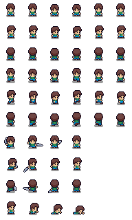

#### Stany roślin

- Rośliny przyjazne (`friendly_plant`): stan suchy/blade (modulate wygaszony) → podlewana (stopniowe rozjaśnianie) → rozkwitnięta (osobny sprite `BloomedSprite` z pulsacją). Nieuratowane „oddychają" (puls naprowadzający).
- Roślina zepsuta w wroga: animacja flashu + spawn `EnemyPlant` na pozycji rośliny (skala ×2)
- Doniczka rozbita — dekoracja terenu po zepsuciu rośliny

| Sucha / podlewana | Rozkwitnięta | Rozbita doniczka |
| --- | --- | --- |
| 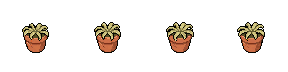 |  | 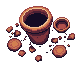 |

#### Wrogowie i bossy

- **Wroga roślina (`EnemyPlant`)** — podstawowy przeciwnik, animacje idle / chase / spine_attack / die
- **Grzybek halucynek (Mushroom)** — dystansowy, animacje walk_east / walk_south / attack / die
- **Pnącze gniewu (BossVine)** — boss melee z animacją uderzenia kolcami (Kuchnia)
- **Grzybek halucynek — boss (BossMushroom)** — boss z aurą gazu (Sypialnia)
- **Palma kokosowa (BossPalm)** — boss 2-fazowy z atakiem dystansowym kokosami (Pokój gamingowy)
- **Kaktus (Cactus)** — animowana dekoracja w menu głównym (walk + attack)
- **Mutant pumpkin** — przeciwnik rezerwowy, nieużywany w rozgrywce
- **Kokos** — pocisk dalekosiężny bossa Palmy

| Pnącze (vine) | Grzybek-boss | Palma (boss) | Grzybek (Mushroom) |
| --- | --- | --- | --- |
| 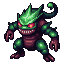 | 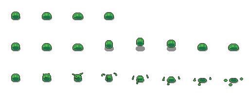 |  | 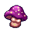 |

| Kaktus (menu) | Pumpkin mutant | Efekt kolców (BossVine) |
| --- | --- | --- |
| 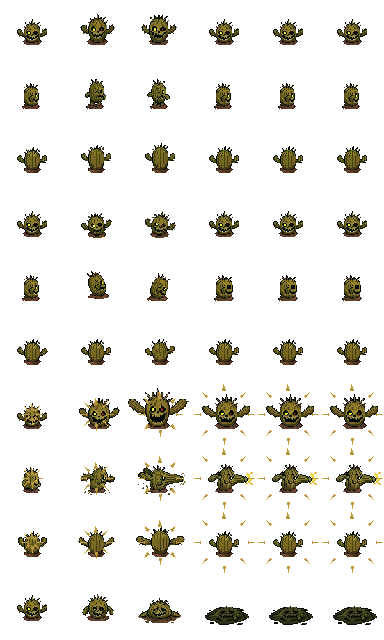 |  |  |

Pocisk bossa Palmy:

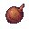

#### Pickupy świata

- **Apteczka** — +30 HP (1 serce)
- **Zgrzewka z butelkami wody** — +25 wody na butelkę, max 6 użyć (sprite blaknie wraz z ubywaniem)
- **Piwo (kufel)** — buff prędkości ×1.5 na 10 s (Q)
- **Kokos (pickup)** — wariant graficzny do efektów świata

| Apteczka | Butelki wody | Piwo (kufel) | Kokos |
| --- | --- | --- | --- |
|  |  |  |  |

#### Tła i obiekty

- **Pokój 0 — Przedpokój**: proste tło z drzwiami po prawej, list na podłodze (`scroll.png`)
- **Pokój 1 — Salon**: kafle podłogowe, kanapa, regał na książki, dywan, telewizor, stolik kawowy, stół jadalny, lodówka, papiery
- **Pokój 2 — Kuchnia**: kafle podłogowe, blat (counter + counter_L), kuchenka, stół (prostokątny i okrągły), lodówka kuchenna
- **Pokój 3 — Sypialnia**: łóżko, szafa, biurko, szafka nocna, regał, dywan
- **Pokój 4 — Pokój gamingowy / Balkon**: balustrada (`balcony_railing` / `balcony_railing_new`), ławka, donica (`balcony_planter`)
- Meble jako niezależne obiekty `StaticBody2D` z kolizjami

##### Współdzielone

| Drzwi | Podłoga (kafle) | Papiery | List / zwój (scroll) |
| --- | --- | --- | --- |
| 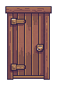 | 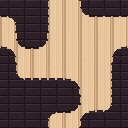 | 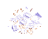 | 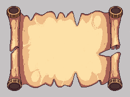 |

##### Meble — Salon

Folder: [furniture/](../game/assets/images/furniture/)

| Kanapa | Stolik kawowy | Stół jadalny | TV cabinet |
| --- | --- | --- | --- |
| 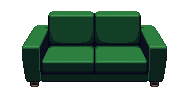 | 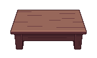 | 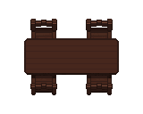 | 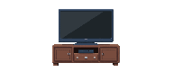 |

| Regał | Dywan | Lodówka |
| --- | --- | --- |
| 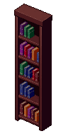 | 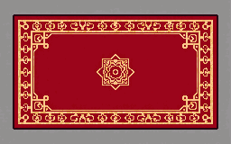 | 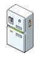 |

##### Meble — Kuchnia

Folder: [furniture/kitchen/](../game/assets/images/furniture/kitchen/)

| Blat | Blat narożny (L) | Kuchenka | Lodówka kuchenna |
| --- | --- | --- | --- |
| 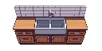 | 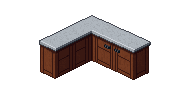 | 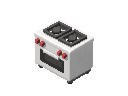 | 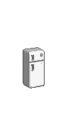 |

| Stół (prostokątny) | Stół (okrągły) |
| --- | --- |
| 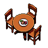 | 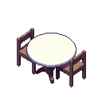 |

##### Meble — Sypialnia

Folder: [furniture/bedroom/](../game/assets/images/furniture/bedroom/)

| Łóżko | Szafa | Biurko | Szafka nocna |
| --- | --- | --- | --- |
| 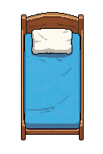 | 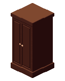 | 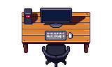 |  |

##### Meble — Balkon / Pokój gamingowy

Folder: [furniture/balcony/](../game/assets/images/furniture/balcony/)

| Ławka | Donica | Balustrada | Balustrada (nowa) |
| --- | --- | --- | --- |
| 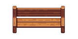 | 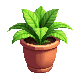 |  |  |

##### Tilesety pomieszczeń

Folder: [tilesets/](../game/assets/images/tilesets/)

Wygenerowane spójne tilesety do dekoracji podłóg i ścian z metadanymi w plikach JSON.

| Salon | Kuchnia |
| --- | --- |
| 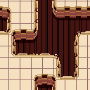 | 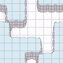 |

#### Ekrany zakończeń

Folder: [endings/](../game/assets/images/endings/) — trzy obrazy tła ekranu zakończenia, dopasowane nastrojem do wariantu fabularnego (mieszkanie ocalałe / bittersweet / płonące).

| Pacyfistyczne (OGRÓD OCALONY) | Neutralne (KRUCHY POKÓJ) | Wrogie (ROŚLINNA APOKALIPSA) |
| --- | --- | --- |
| 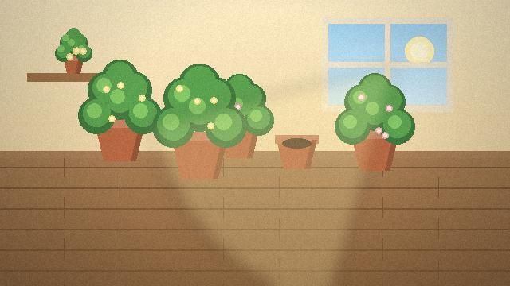 | 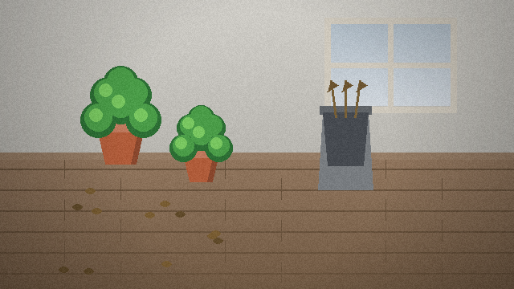 | 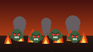 |

#### UI

- Serduszka HP — rysowane programowo (pixel art grid, liczba serc dynamiczna: 3 lub 4)
- Paski zbiornika (ProgressBar: niebieski/woda, zielony/kwas)
- Paski HP wrogów i nawodnienia roślin (region-based Sprite2D) — tekstury `LifeBarMini*`
- Panel piw + ikona kufla, licznik buffu piwa
- Panel trofeów bossów (3 sloty: vine / mushroom / palm)
- Nakładki: ustawienia (`settings_overlay`), ekran sterowania (`controls_overlay`), dialog potwierdzenia (`confirm_dialog`), dialog nagrody (`boss_reward_dialog`), zwój fabularny (`story_scroll`), karta tytułowa (`level_intro`), wskaźnik krawędziowy (`offscreen_indicator`), podpowiedź kontekstowa (`interaction_prompt`)
- Pixel font: „PixelifySans" + „Press Start 2P" (Google Fonts, open license)

| Pasek HP — wypełnienie | Pasek HP — tło |
| --- | --- |
|  |  |

#### Narzędzia graficzne

- Aseprite (pixel art i animacje sprite'ów)
- Photoshop (kompozycje, UI)
- Godot SpriteFrames Editor (konfiguracja animacji)
- Python + Pillow (proceduralne generowanie grafik ekranów zakończeń)
- Skrypt pomocniczy [pixellab_tileset_converter.gd](../game/pixellab_tileset_converter.gd) do konwersji tilesetów z PixelLab

### 6.2. Audio

Audio jest w pełni zaimplementowane przez autoload `AudioManager`, który tworzy magistrale **Music** i **SFX** (routowane do Master, skalowane suwakami z `Settings`), odtwarza zapętloną muzykę z przejściami fade i pozwala bossom przejąć muzykę na czas walki.

| Kategoria | Opis |
| --- | --- |
| **BGM — Muzyka tła** (5 utworów) | `menu_theme` (menu główne), `gameplay_theme` (poziomy) oraz **unikatowe motywy bossów**: `boss_vine`, `boss_mushroom`, `boss_palm`. Pliki w `assets/audio/music/`. |
| **SFX — Efekty dźwiękowe** (18) | `ui_click`, `shoot_water`, `shoot_acid`, `melee` (nożyczki w stylu 8-bit), `hit_enemy`, `enemy_die`, `player_hurt`, `pickup_water`, `pickup_beer`, `pickup_medkit`, `beer_drink`, `door_open`, `water_refill`, `level_complete`, `boss_defeat`, `game_over` oraz dla sekretnego poziomu: `snake_eat`, `snake_over`. Pliki w `assets/audio/sfx/`. |
| **Sterowanie głośnością** | Oddzielne suwaki głośności muzyki i efektów w ustawieniach (zapis do `user://settings.cfg`). |
| **Narracja / dialogi** | Brak voice actingu. Fabuła przekazana listem, zwojami fabularnymi i tutorialami (toasty tekstowe). |
| **Narzędzia audio** | Godot AudioStreamPlayer / magistrale audio, generatory chiptune SFX, Audacity (edycja). Źródła muzyki: kolekcje CC0/CC-BY. |

## 7. Prototyp (Proof of Concept)

### 7.1. Cel prototypu

Celem prototypu jest weryfikacja głównych mechanik gry w środowisku Godot 4.6: ruch, strzelanie, walka wręcz, system podlewania roślin, AI przeciwników, system drzwi/pokojów i HUD. Prototyp przerósł w pełną, ukończoną grę z audio, ustawieniami, zapisem postępu, trzema zakończeniami i warstwą UX.

### 7.2. Technologie i zasoby startowe

| Kategoria | Wartość |
| --- | --- |
| **Silnik** | Godot 4.6.2 |
| **Język** | GDScript |
| **Autoloady** | `GameState` (stan/postęp), `Settings` (głośność/jasność), `AudioManager` (muzyka/SFX) |
| **Kontrola wersji** | Git + GitHub |
| **Edytor** | Godot Editor + Visual Studio Code / Cursor |

### 7.3. Kryteria sukcesu prototypu

- ✅ Gracz porusza się płynnie (8 kierunków, 300 px/s), bez przechodzenia przez ściany
- ✅ Zbiornik wystrzeliwuje wodę/kwas (pociski liniowe 750 px/s), z przełączaniem trybu (X)
- ✅ Woda zwiększa pasek nawodnienia rośliny (+20); kwas zadaje 20 obrażeń wrogowi
- ✅ Nożyczki zadają 20 obrażeń (hitbox kierunkowy); atak możliwy podczas chodzenia
- ✅ Drzwi otwierają się po obsłużeniu wszystkich roślin i pokonaniu wrogów
- ✅ HP gracza (3 serca, +1 po Grzybku), obrażenia od wrogów, knockback + czerwony flash, animacja śmierci, ekran Game Over
- ✅ AI wrogiej rośliny: pościg z aggro-lockiem, atak kontaktowy, knockback, śmierć
- ✅ Dodatkowy typ przeciwnika: Grzybek halucynek (dystansowy, zarodniki)
- ✅ HUD: dynamiczne serduszka, panele zbiorników, panel piwa, cele poziomu, trofea bossów, wskaźnik krawędziowy
- ✅ Menu główne, wybór poziomu, intro (list), karty tytułowe, zwoje fabularne, system tutoriali
- ✅ Przejścia między scenami (Przedpokój → Salon → Kuchnia → Sypialnia → Pokój gamingowy)
- ✅ 3 bossów z różnymi mechanikami (Pnącze — melee slam + kolce, Grzybek — gas slow, Palma — 2 fazy + kokosy), HP ×2/×2.5/×3
- ✅ Permanentne nagrody za bossów (zasięg nożyczek, +1 serce, trofeum)
- ✅ Pickupy świata: apteczka, zgrzewka z butelkami wody, piwo (buff prędkości), lodówka jako źródło piwa
- ✅ Mechanika zepsucia przyjaznej rośliny w wroga + komunikat diagnostyczny
- ✅ Persystencja stanu i postępu (singleton `GameState`, zapis `user://progress.cfg`)
- ✅ Tryb wyboru pojedynczego poziomu (single-level) z toastem; sekretny poziom „Wąż"
- ✅ Trzy zakończenia (pacyfistyczne / neutralne / wrogie) z grafiką i statystykami
- ✅ **Audio**: pełna muzyka (menu, rozgrywka, 3 motywy bossów) i 18 efektów SFX
- ✅ **Ustawienia**: głośność muzyki/SFX, jasność, pełny ekran (F11) — z zapisem
- ✅ **UX**: ekran sterowania, dialogi potwierdzenia, pomijanie samouczka, podpowiedzi kontekstowe, naprowadzanie (puls + strzałka)

Plants Rescue — GDD v5.0
